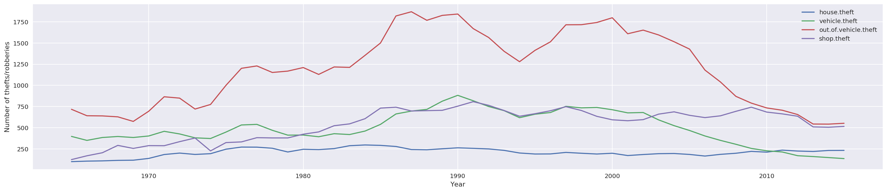

```python
import pandas as pd
from matplotlib import pyplot as plt
import seaborn as sns
import numpy as np
```
Lets start by importing the data set reported.csv
This dataset was taken from Kaggle.com
The data we will be exploring is Swedish Crime Rates

```python
df = pd.read_csv('reported.csv')
```
Lets explore the shape of our dataset

```python
df.shape
```


    (66, 21)


```python
df.dtypes
```


    Year                      int64
    crimes.total              int64
    crimes.penal.code         int64
    crimes.person             int64
    murder                    int64
    assault                   int64
    sexual.offenses           int64
    rape                      int64
    stealing.general          int64
    burglary                  int64
    house.theft             float64
    vehicle.theft           float64
    out.of.vehicle.theft    float64
    shop.theft              float64
    robbery                   int64
    fraud                     int64
    criminal.damage           int64
    other.penal.crimes        int64
    narcotics               float64
    drunk.driving             int64
    population                int64
    dtype: object


We see that we have 66 rows and 21 columns. All of the columns are encoded as numeric types (ints and floats). Let's check the head of the data to get a better ense of what the variables are. Let's check the head of the data to get a better sense of what the variables are


```python
df.head(5)
```


<div>
<style scoped>
    .dataframe tbody tr th:only-of-type {
        vertical-align: middle;
    }

    .dataframe tbody tr th {
        vertical-align: top;
    }

    .dataframe thead th {
        text-align: right;
    }
</style>
<table border="1" class="dataframe">
  <thead>
    <tr style="text-align: right;">
      <th></th>
      <th>Year</th>
      <th>crimes.total</th>
      <th>crimes.penal.code</th>
      <th>crimes.person</th>
      <th>murder</th>
      <th>assault</th>
      <th>sexual.offenses</th>
      <th>rape</th>
      <th>stealing.general</th>
      <th>burglary</th>
      <th>...</th>
      <th>vehicle.theft</th>
      <th>out.of.vehicle.theft</th>
      <th>shop.theft</th>
      <th>robbery</th>
      <th>fraud</th>
      <th>criminal.damage</th>
      <th>other.penal.crimes</th>
      <th>narcotics</th>
      <th>drunk.driving</th>
      <th>population</th>
    </tr>
  </thead>
  <tbody>
    <tr>
      <th>0</th>
      <td>1950</td>
      <td>2784</td>
      <td>2306</td>
      <td>120</td>
      <td>1</td>
      <td>105</td>
      <td>40</td>
      <td>5</td>
      <td>1578</td>
      <td>295</td>
      <td>...</td>
      <td>NaN</td>
      <td>NaN</td>
      <td>NaN</td>
      <td>3</td>
      <td>209</td>
      <td>72</td>
      <td>477</td>
      <td>0.0</td>
      <td>49</td>
      <td>7014000</td>
    </tr>
    <tr>
      <th>1</th>
      <td>1951</td>
      <td>3284</td>
      <td>2754</td>
      <td>125</td>
      <td>1</td>
      <td>109</td>
      <td>45</td>
      <td>6</td>
      <td>1899</td>
      <td>342</td>
      <td>...</td>
      <td>NaN</td>
      <td>NaN</td>
      <td>NaN</td>
      <td>3</td>
      <td>310</td>
      <td>73</td>
      <td>530</td>
      <td>0.0</td>
      <td>66</td>
      <td>7073000</td>
    </tr>
    <tr>
      <th>2</th>
      <td>1952</td>
      <td>3160</td>
      <td>2608</td>
      <td>119</td>
      <td>1</td>
      <td>104</td>
      <td>39</td>
      <td>4</td>
      <td>1846</td>
      <td>372</td>
      <td>...</td>
      <td>NaN</td>
      <td>NaN</td>
      <td>NaN</td>
      <td>3</td>
      <td>217</td>
      <td>82</td>
      <td>553</td>
      <td>0.0</td>
      <td>78</td>
      <td>7125000</td>
    </tr>
    <tr>
      <th>3</th>
      <td>1953</td>
      <td>2909</td>
      <td>2689</td>
      <td>119</td>
      <td>1</td>
      <td>105</td>
      <td>45</td>
      <td>5</td>
      <td>1929</td>
      <td>361</td>
      <td>...</td>
      <td>NaN</td>
      <td>NaN</td>
      <td>NaN</td>
      <td>4</td>
      <td>209</td>
      <td>88</td>
      <td>220</td>
      <td>0.0</td>
      <td>91</td>
      <td>7171000</td>
    </tr>
    <tr>
      <th>4</th>
      <td>1954</td>
      <td>3028</td>
      <td>2791</td>
      <td>126</td>
      <td>1</td>
      <td>107</td>
      <td>41</td>
      <td>5</td>
      <td>1981</td>
      <td>393</td>
      <td>...</td>
      <td>NaN</td>
      <td>NaN</td>
      <td>NaN</td>
      <td>4</td>
      <td>236</td>
      <td>101</td>
      <td>237</td>
      <td>0.0</td>
      <td>103</td>
      <td>7213000</td>
    </tr>
  </tbody>
</table>
<p>5 rows × 21 columns</p>
</div>


Because of the number of columns not all columns are displayed but we can see that there are some columns that have empty values. Let us now look at a statistical summary of the variables

```python
df.describe()
```


<div>
<style scoped>
    .dataframe tbody tr th:only-of-type {
        vertical-align: middle;
    }

    .dataframe tbody tr th {
        vertical-align: top;
    }

    .dataframe thead th {
        text-align: right;
    }
</style>
<table border="1" class="dataframe">
  <thead>
    <tr style="text-align: right;">
      <th></th>
      <th>Year</th>
      <th>crimes.total</th>
      <th>crimes.penal.code</th>
      <th>crimes.person</th>
      <th>murder</th>
      <th>assault</th>
      <th>sexual.offenses</th>
      <th>rape</th>
      <th>stealing.general</th>
      <th>burglary</th>
      <th>...</th>
      <th>vehicle.theft</th>
      <th>out.of.vehicle.theft</th>
      <th>shop.theft</th>
      <th>robbery</th>
      <th>fraud</th>
      <th>criminal.damage</th>
      <th>other.penal.crimes</th>
      <th>narcotics</th>
      <th>drunk.driving</th>
      <th>population</th>
    </tr>
  </thead>
  <tbody>
    <tr>
      <th>count</th>
      <td>66.000000</td>
      <td>66.000000</td>
      <td>66.000000</td>
      <td>66.000000</td>
      <td>66.000000</td>
      <td>66.000000</td>
      <td>66.000000</td>
      <td>66.000000</td>
      <td>66.000000</td>
      <td>66.000000</td>
      <td>...</td>
      <td>59.000000</td>
      <td>51.000000</td>
      <td>51.000000</td>
      <td>66.000000</td>
      <td>66.000000</td>
      <td>66.000000</td>
      <td>66.000000</td>
      <td>62.000000</td>
      <td>66.000000</td>
      <td>6.600000e+01</td>
    </tr>
    <tr>
      <th>mean</th>
      <td>1982.500000</td>
      <td>10084.257576</td>
      <td>8695.181818</td>
      <td>451.287879</td>
      <td>1.757576</td>
      <td>423.106061</td>
      <td>75.318182</td>
      <td>20.045455</td>
      <td>5580.545455</td>
      <td>1240.681818</td>
      <td>...</td>
      <td>466.288136</td>
      <td>1192.568627</td>
      <td>540.294118</td>
      <td>48.060606</td>
      <td>730.636364</td>
      <td>879.484848</td>
      <td>1383.303030</td>
      <td>386.629032</td>
      <td>225.757576</td>
      <td>8.341848e+06</td>
    </tr>
    <tr>
      <th>std</th>
      <td>19.196354</td>
      <td>4223.893287</td>
      <td>3582.148938</td>
      <td>295.041002</td>
      <td>0.724529</td>
      <td>281.839023</td>
      <td>48.136396</td>
      <td>19.147550</td>
      <td>2089.329161</td>
      <td>456.699806</td>
      <td>...</td>
      <td>193.701161</td>
      <td>432.536438</td>
      <td>185.298710</td>
      <td>35.412679</td>
      <td>395.296097</td>
      <td>605.272253</td>
      <td>717.521867</td>
      <td>307.130945</td>
      <td>66.349902</td>
      <td>7.179351e+05</td>
    </tr>
    <tr>
      <th>min</th>
      <td>1950.000000</td>
      <td>2784.000000</td>
      <td>2306.000000</td>
      <td>119.000000</td>
      <td>1.000000</td>
      <td>104.000000</td>
      <td>29.000000</td>
      <td>4.000000</td>
      <td>1578.000000</td>
      <td>295.000000</td>
      <td>...</td>
      <td>135.000000</td>
      <td>542.000000</td>
      <td>123.000000</td>
      <td>3.000000</td>
      <td>209.000000</td>
      <td>72.000000</td>
      <td>220.000000</td>
      <td>0.000000</td>
      <td>49.000000</td>
      <td>7.014000e+06</td>
    </tr>
    <tr>
      <th>25%</th>
      <td>1966.250000</td>
      <td>6152.500000</td>
      <td>5336.000000</td>
      <td>185.250000</td>
      <td>1.000000</td>
      <td>167.750000</td>
      <td>41.000000</td>
      <td>8.000000</td>
      <td>3786.750000</td>
      <td>918.250000</td>
      <td>...</td>
      <td>339.500000</td>
      <td>753.500000</td>
      <td>379.000000</td>
      <td>13.250000</td>
      <td>476.500000</td>
      <td>301.250000</td>
      <td>816.750000</td>
      <td>201.250000</td>
      <td>178.000000</td>
      <td>7.823000e+06</td>
    </tr>
    <tr>
      <th>50%</th>
      <td>1982.500000</td>
      <td>11654.000000</td>
      <td>9637.000000</td>
      <td>370.500000</td>
      <td>2.000000</td>
      <td>345.000000</td>
      <td>50.000000</td>
      <td>11.000000</td>
      <td>5928.000000</td>
      <td>1331.000000</td>
      <td>...</td>
      <td>419.000000</td>
      <td>1210.000000</td>
      <td>606.000000</td>
      <td>42.000000</td>
      <td>640.000000</td>
      <td>818.000000</td>
      <td>1465.000000</td>
      <td>350.000000</td>
      <td>238.000000</td>
      <td>8.327000e+06</td>
    </tr>
    <tr>
      <th>75%</th>
      <td>1998.750000</td>
      <td>13663.750000</td>
      <td>12002.500000</td>
      <td>690.500000</td>
      <td>2.000000</td>
      <td>658.000000</td>
      <td>97.000000</td>
      <td>23.000000</td>
      <td>7444.500000</td>
      <td>1653.250000</td>
      <td>...</td>
      <td>660.500000</td>
      <td>1580.000000</td>
      <td>695.000000</td>
      <td>83.500000</td>
      <td>1080.250000</td>
      <td>1351.500000</td>
      <td>1776.500000</td>
      <td>539.250000</td>
      <td>272.500000</td>
      <td>8.856250e+06</td>
    </tr>
    <tr>
      <th>max</th>
      <td>2015.000000</td>
      <td>15342.000000</td>
      <td>12803.000000</td>
      <td>1005.000000</td>
      <td>4.000000</td>
      <td>947.000000</td>
      <td>210.000000</td>
      <td>69.000000</td>
      <td>8650.000000</td>
      <td>1878.000000</td>
      <td>...</td>
      <td>882.000000</td>
      <td>1869.000000</td>
      <td>807.000000</td>
      <td>104.000000</td>
      <td>1896.000000</td>
      <td>2175.000000</td>
      <td>2721.000000</td>
      <td>1002.000000</td>
      <td>337.000000</td>
      <td>9.851000e+06</td>
    </tr>
  </tbody>
</table>
<p>8 rows × 21 columns</p>
</div>


Looking at the statistics we see that there are some columns with missing data. Most of the columns are only missing a few values so in this case it will not affect the dataset too much if we drops those rows. Before dropping any rows, lets play aroud with some methods that finds missing values.

```python
all_nan_cols = df.columns[df.isna().all()]
all_nan_cols
```


    Index([], dtype='object')


```python
any_nan_cols = df.columns[df.isna().any()]
any_nan_cols
```


    Index(['house.theft', 'vehicle.theft', 'out.of.vehicle.theft', 'shop.theft',
           'narcotics'],
          dtype='object')


We can see that using df.isna().all() returns no columns because there are no columns that only contain NAN values. However using the .any() function we get a number of columns that contain some NAN values. 

From here we could determine which columsn we can drop the rows that contain NAN values.

Lets look at the shop.theft column before moving on

```python
df['shop.theft'].describe()
```


    count     51.000000
    mean     540.294118
    std      185.298710
    min      123.000000
    25%      379.000000
    50%      606.000000
    75%      695.000000
    max      807.000000
    Name: shop.theft, dtype: float64


```python
df.hist(column='shop.theft', figsize=(9,6), bins=10)
```


    array([[<matplotlib.axes._subplots.AxesSubplot object at 0x7fca480cda90>]], dtype=object)


After plotting the histogram we see that most of the values are between 600 and 700, lets have a look at the average 

```python
df['shop.theft'].mean()
```


    540.2941176470588


We will now fill all the NAN with the average 

```python
df['shop.theft'].fillna(df['shop.theft'].mean(), inplace=True)
```
After filling the values lets plot over the histogram and see the difference

```python

df.hist(column='shop.theft', figsize=(9,6), bins=10)
```


    array([[<matplotlib.axes._subplots.AxesSubplot object at 0x7fca480732e8>]], dtype=object)


Now for the rest of values we will simply drop all the NAN rows because there only a few of them

```python
df.dropna(axis=0, inplace=True)
```


```python
any_nan_cols = df.columns[df.isna().any()]
any_nan_cols
```


    Index([], dtype='object')


```python
Let explor how crime has changed over the years vs the population
```


```python
plt.plot(df['Year'],df['crimes.total'])
plt.xlabel('Year')
plt.ylabel('Number of crimes')
plt.legend()
```


    <matplotlib.legend.Legend at 0x7fca452d45f8>


From the graph we can see that crime has increased significantly over the years. Lets now look at how the populations has changed over the years

```python
plt.plot(df['Year'],df['population'])
plt.xlabel('Year')
plt.ylabel('Population')
plt.legend()
```


    <matplotlib.legend.Legend at 0x7fca454456d8>


Look at both results we can assume the crime has increased as the population increased.Let us now examine the different crimes rates and how they have changed with respect to the population

```python
columns = df.columns
for c in [col for col in df.columns if 'theft' in col.lower:
    if c is not 'Year':
        if 'theft' in c.lower():
            plt.plot(df['Year'],df[c])
plt.xlabel('Year')
plt.ylabel('Number of thefts/robberies')
plt.legend()
```


    <matplotlib.legend.Legend at 0x7fca455f60b8>





We can see that out of vehicle theft is the most promanent crime. Let us now look at drug related crime and how they have changed over the years.

```python
plt.plot(df['Year'],df['narcotics'])
plt.plot(df['Year'],df['drunk.driving'])
plt.xlabel('Year')
plt.ylabel('Number of crimes')
plt.legend()
```


    <matplotlib.legend.Legend at 0x7fca44342908>


```python
plt.plot(df['Year'],df['narcotics'])
plt.plot(df['Year'],df['drunk.driving'])
plt.plot(df['Year'],df['crimes.total'])
plt.xlabel('Year')
plt.ylabel('Number of crimes')
plt.legend()
```


    <matplotlib.legend.Legend at 0x7fca443057f0>


